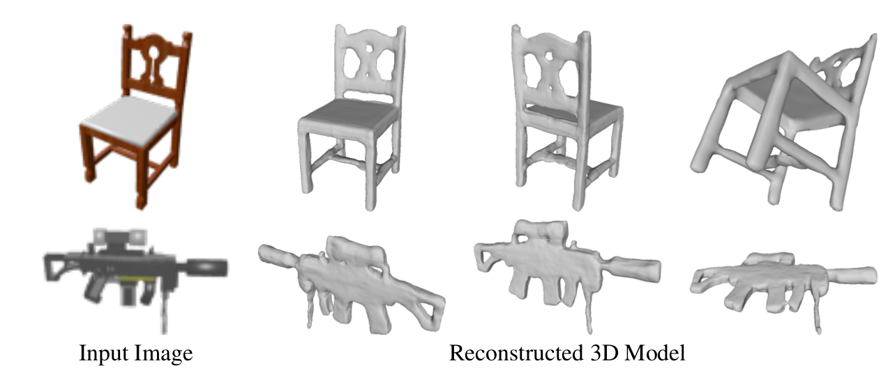

# DISN: Deep Implicit Surface Network for High-quality Single-view 3D Reconstruction
Please report bugs [here](https://github.com/Xharlie/DISN) and we will publish the bug fix and the latest [updates](https://github.com/Xharlie/DISN)
Please cite our paper
[DISN: Deep Implicit Surface Network for High-quality Single-view 3D Reconstruction (NeurIPS 2019)](https://arxiv.org/abs/1905.10711)

``` 
@inProceedings{xu2019disn,
  title={DISN: Deep Implicit Surface Network for High-quality Single-view 3D Reconstruction},
  author={Wang, WeiyueXu and Xu, Qiangeng and Ceylan, Duygu and Mech, Radomir and Neumann, Ulrich},
  booktitle={NeurIPS},
  year={2019}
}
``` 
Code contact: [Qiangeng Xu*](https://xharlie.github.io/) and [Weiyue Wang*](https://weiyuewang.github.io/)



## Installation
  ```
    pip install trimesh==2.37.20
    cd {DISN}
    mkdir checkpoint
    get checkpoint
    wget https://www.dropbox.com/s/2ts7qc9w4opl4w4/SDF_DISN.tar?dl=0
    tar -xvzf SDF_DISN.tar?dl=0
    rm -rf SDF_DISN.tar?dl=0
    cd ..
    mkdir cam_est/checkpoint
    cd cam_est/checkpoint
    wget https://www.dropbox.com/s/hyv4lcvpfu0au9e/cam_DISN.tar?dl=0
    tar -xvzf cam_DISN.tar?dl=0
    rm -rf cam_DISN.tar?dl=0
    cd ../../
    
  ```
## Demo:
 * --sdf_res control the resolution of the sampled sdf, default is 64, the larger, the more fine-grained, but slower.
  ```
    cd {DISN}
    source isosurface/LIB_PATH
    nohup python -u demo/demo.py --cam_est --log_dir checkpoint/SDF_DISN --cam_log_dir cam_est/checkpoint/cam_DISN --img_feat_twostream --sdf_res 256 &> log/create_sdf.log &
  ``` 
  The result is demo/result.obj.
  
## Data Preparation

* ### file location setup:
  * under preprocessing/info.json, you can change the locations of your data: the neccessary dir for the main model are : 
   ```  
        "raw_dirs_v1": {
        "mesh_dir": "/ssd1/datasets/ShapeNet/ShapeNetCore.v1/",
        "norm_mesh_dir": "/ssd1/datasets/ShapeNet/march_cube_objs_v1/",
        "rendered_dir": "/ssd1/datasets/ShapeNet/ShapeNetRendering/",
        "renderedh5_dir": "/ssd1/datasets/ShapeNet/ShapeNetRenderingh5_v1/",
        "sdf_dir": "/ssd1/datasets/ShapeNet/SDF_v1/"
        }
   ```
  
* ### Download ShapeNetCore.v1 
  download the dataset following the instruction of https://www.shapenet.org/account/  (about 30GB)
  
  ```
  cd {your download dir}
  wget http://shapenet.cs.stanford.edu/shapenet/obj-zip/ShapeNetCore.v1.zip 
  unzip ShapeNetCore.v1.zip -d {your mesh_dir}
  ```
  
* ### Generate sdf files and the reconstructed models from the sdf file (Please expect the script to run for several hours)
    Our data preparation used this paper [Vega: non-linear fem deformable object simulator](http://run.usc.edu/vega/SinSchroederBarbic2012.pdf). Please also cite it if you use our code to generate sdf files
  ```
  mkdir log
  cd {DISN}
  source isosurface/LIB_PATH
  nohup python -u preprocessing/create_point_sdf_grid.py --thread_num {recommend 9} --category {default 'all', but can be single category like 'chair'} &> log/create_sdf.log &
  
  ## SDF folder takes about 9.0G, marching cube obj folder takes about 245G
  
  ```
* ### Download and generate 2d image h5 files:
  * #### download 2d image following 3DR2N2[https://github.com/chrischoy/3D-R2N2], please cite their paper if you use this image tar file:
  
  ```
  wget http://cvgl.stanford.edu/data2/ShapeNetRendering.tgz
  untar it to {your rendered_dir}
  ```
  * #### run h5 file generation (about 26 GB) :
  
  ```
  cd {DISN}
  nohup python -u preprocessing/create_img_h5.py &> log/create_imgh5.log &
  ```

##  Camera parameters estimation network

* ### train the camera parameters estimation network:
  ```
  ### train the camera poses of the original rendered image dataset. 
    nohup python -u cam_est/train_sdf_cam.py --log_dir checkpoint/{your training checkpoint dir} --gpu 0 --loss_mode 3D --learning_rate 2e-5 &> log/cam_3D_all.log &
   
  ### train the camera poses of the adding 2 more DoF augmented on the rendered image dataset. 
    nohup python -u cam_est/train_sdf_cam.py --log_dir checkpoint/{your training checkpoint dir} --gpu 2 --loss_mode 3D --learning_rate 1e-4 --shift --shift_weight 2 &> log/cam_3D_shift2_all.log &
    
  ```
* ### create h5 file of image and estimated cam parameters:
  ```
  ＃＃＃　Create img_h5 to {renderedh5_dir_est} in your info.json, the default is only generate h5 of test images and cam parameters(about 5.3GB) 
  nohup python -u train_sdf_cam.py --img_h5_dir {renderedh5_dir_est} --create --restore_model checkpoint/cam_3D_all --log_dir checkpoint/{your training checkpoint dir} --gpu 0--loss_mode 3D --batch_size 24 &> log/create_cam_mixloss_all.log &
  ```
  
## SDF generation network:

* ### train the sdf generation with provided camera parameters:

  if train from scratch, you can load official pretrained vgg_16 by setting --restore_modelcnn; or you can  --restore_model to your checkpoint to continue the training):

  * support flip the background color from black to white since most online images have white background(by using --backcolorwhite)
  * if use flag --cam_est, the img_h5 is loaded from {renderedh5_dir_est} instead of {renderedh5_dir}, so that we can train the generation on the estimated camera parameters
  ```
  nohup python -u train/train_sdf.py --gpu 0 --img_feat_twostream --restore_modelcnn ./models/CNN/pretrained_model/vgg_16.ckpt --log_dir checkpoint/{your training checkpoint dir} --category all --num_sample_points 2048 --batch_size 20 --learning_rate 0.0001 --cat_limit 36000 &> log/DISN_train_all.log &
  ```

* ### inference sdf and create mesh objects:

  * will save objs in {your training checkpoint dir}/test_objs/{sdf_res+1}_{iso}
  * will save objs in {your training checkpoint dir}/test_objs/{sdf_res+1}_{iso}
  * if use estimated camera post, --cam_est, will save objs in {your training checkpoint dir}/test_objs/camest_{sdf_res+1}_{iso}
  * if only create chair or a single category, --category {chair or a single category}
  * --sdf_res control the resolution of the sampled sdf, default is 64, the larger, the more fine-grained, but slower.
  ```
  source isosurface/LIB_PATH

  #### use ground truth camera pose
  nohup python -u test/create_sdf.py --img_feat_twostream --view_num 24 --sdf_res 64 --batch_size 1  --gpu 0 --sdf_res 64 --log_dir checkpoint/{your training checkpoint dir} --iso 0.00 --category all  &> log/DISN_create_all.log &
  
  #### use estimated camera pose
  nohup python -u test/create_sdf.py --img_feat_twostream --view_num 24 --sdf_res 64 --batch_size 1  --gpu 3 --sdf_res 64 --log_dir checkpoint/{your training checkpoint dir} --iso 0.00 --category all --cam_est &> log/DISN_create_all_cam.log &
  ```
* ### clean small objects:
  * #### if the model doens't converge well, you can clean flying parts that generated by mistakes
  ```
  nohup python -u clean_smallparts.py --src_dir checkpoint/{your training checkpoint dir}/test_objs/65_0.0 --tar_dir checkpoint/{your training checkpoint dir}/test_objs/65_0.0 --thread_n 10 &> log/DISN_clean.log &
  ```

## Evaluation:
### please compile models/tf_ops/ approxmatch and nn_distance and cites "A Point Set Generation Network for 3D Object Reconstruction from a Single Image"
* ### Chamfer Distance and Earth Mover Distance:
  * #### cal_dir specify which obj folder to be tested, e.g. if only test watercraft, --category watercraft
  ```
   nohup python -u test/test_cd_emd.py --img_feat_twostream --view_num 24 --num_sample_points 2048 --gpu 0 --batch_size 24 --log_dir checkpoint/{your training checkpoint dir} --cal_dir checkpoint/{your training checkpoint dir}/test_objs/65_0.0 --category all &> log/DISN_cd_emd_all.log & 
  ```
* ### F-Score caluculation:
  * cal_dir specify which obj folder to be tested, e.g. if only test watercraft, --category watercraft
  also the threshold of true can be set, here we use 2.5 for default:
  ```
   nohup python -u test/test_f_score.py --img_feat_twostream --view_num 24 --num_sample_points 2048 --gpu 0 --batch_size 24 --log_dir checkpoint/{your training checkpoint dir} --cal_dir checkpoint/{your training checkpoint dir}/test_objs/65_0.0 --category all --truethreshold 2.5 &> log/DISN_fscore_2.5.log & 
  ```
 * ### IOU caluculation:
    * cal_dir specify which obj folder to be tested, e.g. if only test watercraft, --category watercraft
    * --dim specify the number of voxels along each 3D dimension.

    ```
      nohup python -u test/test_iou.py --img_feat_twostream --view_num 24 --log_dir checkpoint/{your training checkpoint dir} --cal_dir checkpoint/{your training checkpoint dir}/test_objs/65_0.0 --category all --dim 110 &> DISN_iou_all.log &
    ```
