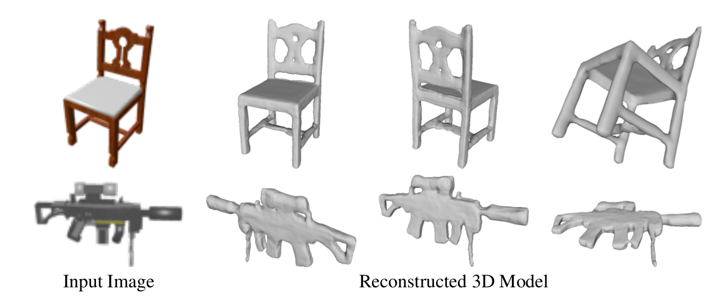

# DISN: Deep Implicit Surface Network for High-quality Single-view 3D Reconstruction[<a href="https://arxiv.org/abs/1905.10711">Arxiv</a>][<a href="https://weiyuewang.github.io/papers/neurips_2019_supp.pdf">Supp</a>]

Code will be released upon publication.

### Citation
        @article{wang2019DISN,
            title={DISN: Deep Implicit Surface Network for High-quality Single-view 3D Reconstruction},
            author={Wang, Weiyue and Qiangeng, Xu and Ceylan, Duygu and Mech, Radomir and Neumann, Ulrich},
            journal={arXiv preprint arXiv:1905.10711},
            year={2019}
        }

